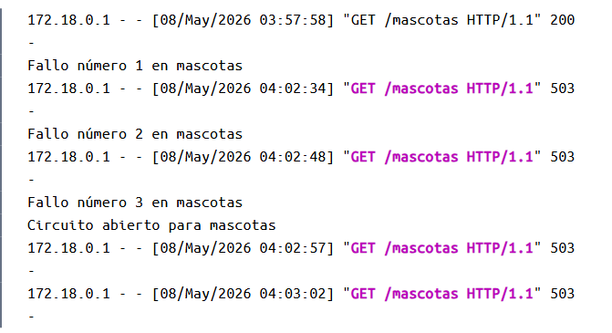
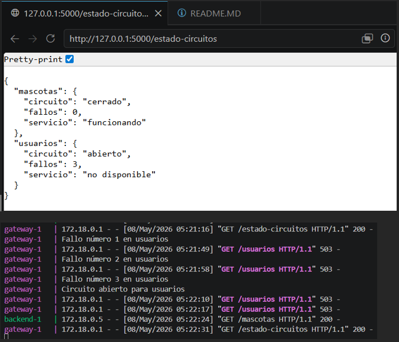
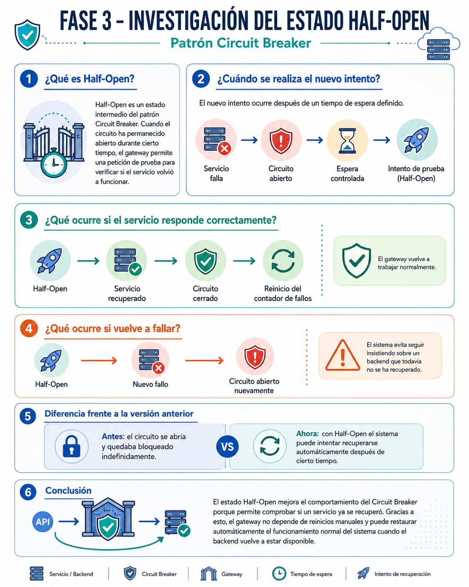
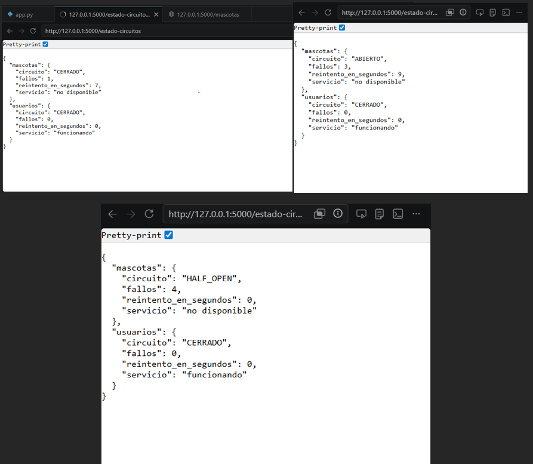
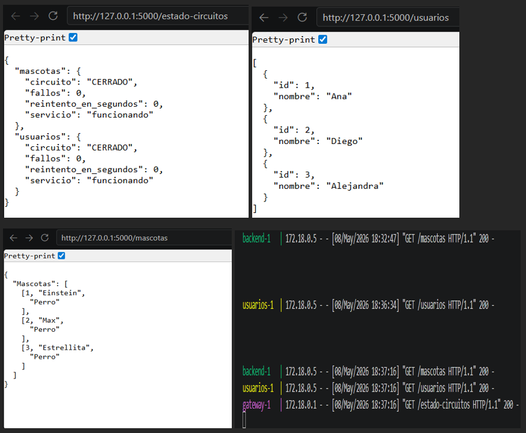
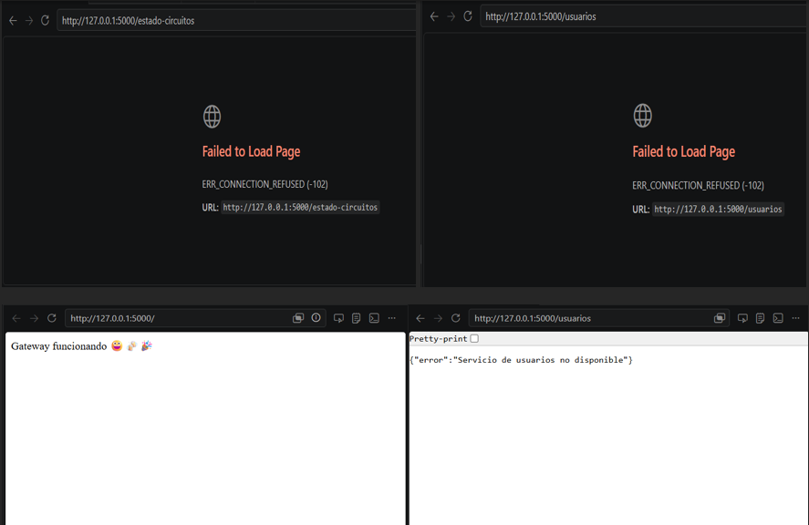
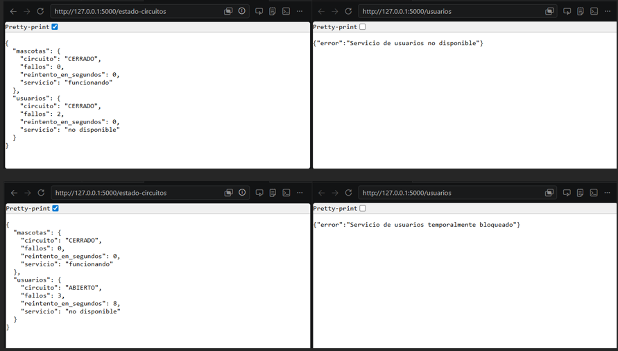
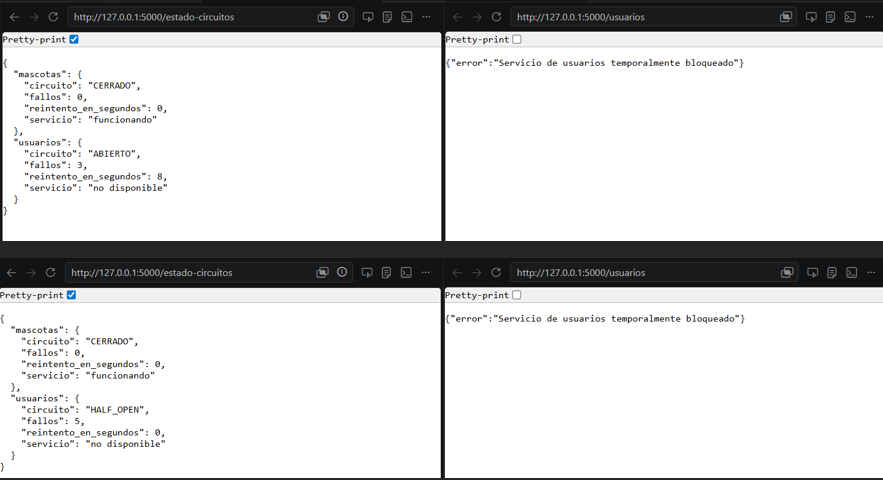

# Laboratorio – Circuit Breaker y recuperación de servicios

## FASE 1 – OBSERVACIÓN DEL COMPORTAMIENTO DEL SISTEMA

### Objetivo

En esta primera fase se analizó cómo reaccionaba el gateway cuando uno de los servicios dejaba de funcionar. Para realizar la prueba se apagó el servicio de mascotas y posteriormente se enviaron varias solicitudes al gateway.

---

## Desactivación del servicio de mascotas

El servicio de mascotas fue detenido directamente desde Docker para simular una caída del backend.

Contenedor detenido:

```txt
backend-1
```

También se utilizó el siguiente comando:

```bash
docker compose stop backend
```

Con esto se confirmó que el servicio ya no estaba disponible para responder peticiones.

---

## Pruebas realizadas al gateway

Después de apagar el servicio, se hicieron varias solicitudes al endpoint:

```txt
http://localhost:5000/mascotas
```

Durante los primeros intentos el gateway trató de conectarse normalmente, pero después de varios errores comenzó a responder:

```json
{
  "error": "Servicio temporalmente bloqueado"
}
```

Esto mostró que el Circuit Breaker detectó repetidos fallos y decidió bloquear temporalmente las llamadas hacia el backend.

---

## Revisión de logs

Para observar el comportamiento interno del sistema se ejecutó:

```bash
docker compose logs -f gateway
```

En los registros del gateway se observó algo similar a:

```txt
Fallo número 1
Fallo número 2
Fallo número 3
Circuito abierto
```

Esto evidencia que el gateway intentó conectarse varias veces antes de abrir el circuito.

---

## Análisis de comportamiento

### ¿Qué hace actualmente el sistema?

Cuando el servicio de mascotas no está disponible, el gateway sigue intentando comunicarse con él. Cada intento fallido incrementa el contador de errores.

Al alcanzar el límite configurado de fallos, el sistema abre el circuito y deja de enviar nuevas solicitudes al backend.

---

### ¿El sistema insiste o se protege?

El sistema se protege después de varios errores consecutivos.

En lugar de seguir intentando indefinidamente, el gateway responde directamente con un error controlado:

```json
{
  "error": "Servicio temporalmente bloqueado"
}
```

La validación utilizada es:

```python
if circuito_abierto:
    return {"error": "Servicio temporalmente bloqueado"}, 503
```

Esto evita llamadas innecesarias a un servicio que ya se sabe que está caído.

---

## Explicación general de la prueba

La prueba permitió comprobar que el gateway detecta cuándo un servicio deja de responder.

Después de varios intentos fallidos, el Circuit Breaker entra en estado abierto y bloquea temporalmente las peticiones. De esta forma se evita seguir consumiendo recursos intentando conectarse a un servicio caído.

---

## Evidencia de la Fase 1



---

## Conclusión de la Fase 1

Se comprobó que el gateway ya cuenta con una implementación básica de Circuit Breaker en el endpoint `/mascotas`.

El sistema puede detectar errores repetitivos y bloquear temporalmente el acceso al servicio cuando supera el límite de fallos configurado.

Sin embargo, todavía no existe un mecanismo automático de recuperación, por lo que el circuito permanece abierto hasta reiniciar el sistema o modificar manualmente el estado.

---

# FASE 2 – IMPLEMENTACIÓN DEL CIRCUIT BREAKER EN MÁS ENDPOINTS

## Objetivo de la fase

El objetivo fue extender la lógica del Circuit Breaker a otros servicios del gateway para evitar que todos dependieran del mismo estado de error.

Los endpoints trabajados fueron:

```txt
/usuarios
/estado-circuitos
```

La idea principal fue que cada servicio manejara su propio circuito y su propio contador de fallos.

---

## Cambios realizados en el gateway

El archivo principal modificado fue:

```txt
gateway/app.py
```

Se agregaron variables independientes para controlar el estado de cada servicio.

Ejemplo:

```python
fallos_backend = 0
circuito_backend_abierto = False

fallos_usuarios = 0
circuito_usuarios_abierto = False
```

Gracias a esto, si un servicio falla, el otro puede continuar funcionando normalmente.

---

## Funcionamiento del endpoint de usuarios

El endpoint `/usuarios` ahora verifica primero si el circuito está abierto:

```python
if circuito_usuarios_abierto:
    return {"error": "Servicio de usuarios temporalmente bloqueado"}, 503
```

Si el circuito está cerrado, intenta conectarse al servicio:

```python
response = requests.get("http://usuarios:5000/usuarios", timeout=2)
```

Cuando la petición funciona correctamente, el contador vuelve a cero:

```python
fallos_usuarios = 0
```

Si ocurre un error, el contador aumenta:

```python
fallos_usuarios += 1
```

Y al llegar al límite de fallos:

```python
circuito_usuarios_abierto = True
```

---

## Funcionamiento del endpoint de mascotas

El endpoint `/mascotas` conserva la misma lógica implementada inicialmente.

Primero valida si el circuito está abierto:

```python
if circuito_backend_abierto:
    return {"error": "Servicio de mascotas temporalmente bloqueado"}, 503
```

Si el servicio responde correctamente, el contador se reinicia:

```python
fallos_backend = 0
```

En caso de fallo:

```python
fallos_backend += 1
```

Y después de varios errores consecutivos:

```python
circuito_backend_abierto = True
```

---

## Endpoint agregado para monitorear circuitos

Se creó un endpoint adicional llamado:

```txt
/estado-circuitos
```

Este endpoint permite visualizar el estado actual de cada circuito.

Ejemplo de respuesta:

```json
{
  "mascotas": {
    "servicio": "funcionando",
    "circuito": "cerrado",
    "fallos": 0
  },
  "usuarios": {
    "servicio": "no disponible",
    "circuito": "abierto",
    "fallos": 3
  }
}
```

Esto facilita verificar qué servicio se encuentra funcionando y cuál está bloqueado y registrar la catidad de fallos para cada servicio.

---

## Pruebas realizadas

Primero se comprobó que ambos endpoints funcionaran correctamente:

```txt
http://localhost:5000/usuarios
http://localhost:5000/mascotas
```

Posteriormente se apagó el servicio de usuarios:

```bash
docker compose stop usuarios
```

Después de varias peticiones al endpoint `/usuarios`, el sistema respondió:

```json
{
  "error": "Servicio de usuarios temporalmente bloqueado"
}
```

Mientras tanto, el endpoint `/mascotas` continuó funcionando con normalidad.

---

## Verificación de independencia entre servicios

La prueba permitió confirmar que los circuitos funcionan de forma independiente.

Ejemplo:

```txt
usuarios → circuito abierto
mascotas → funcionando normalmente
```

Esto evita que la caída de un servicio afecte todo el sistema.

---

## Logs observados

Los logs mostraron el comportamiento esperado:

```txt
Fallo número 1 en usuarios
Fallo número 2 en usuarios
Fallo número 3 en usuarios
Circuito abierto para usuarios
```

Con esto se comprobó que el gateway detectó correctamente la caída del servicio.

---

## Respuestas del análisis

### ¿Cada servicio debe tener su propio contador?

Sí. Cada servicio necesita controlar sus propios errores para evitar que un fallo afecte el estado de otro servicio.

---

### ¿Los circuitos deben ser independientes?

Sí. Cada endpoint debe manejar su propio circuito para mantener la disponibilidad parcial del sistema.

---

### ¿Qué ocurre si un servicio falla y el otro sigue activo?

El gateway solamente bloquea el servicio que presenta errores.

Por ejemplo:

```txt
/usuarios → bloqueado
/mascotas → operativo
```

Esto mejora la estabilidad general del sistema.

---

## Evidencia de la Fase 2



---

## Conclusión de la Fase 2

La implementación permitió que cada servicio tuviera su propio Circuit Breaker.

Gracias a esto, una falla en usuarios ya no afecta el funcionamiento del servicio de mascotas y viceversa.

El sistema ahora es más resistente y puede continuar funcionando parcialmente incluso cuando uno de los servicios presenta errores.

---

## Evidencia de la Fase 3



---

## Conclusión de la Fase 3

El estado Half-Open mejora el comportamiento del Circuit Breaker porque permite comprobar si un servicio ya se recuperó.

Gracias a esto, el gateway no depende de reinicios manuales y puede restaurar automáticamente el funcionamiento normal del sistema cuando el backend vuelve a estar disponible.

---

## FASE 4 – IMPLEMENTAR: Recuperación del Circuit Breaker

En esta fase se implementó la recuperación automática del Circuit Breaker mediante el estado **Half-Open**.

Se agregó una espera controlada de **10 segundos**. Cuando un servicio falla varias veces, el circuito se abre y deja de enviar peticiones temporalmente. Después del tiempo de espera, el gateway realiza un nuevo intento de conexión para verificar si el servicio ya se recuperó.

### ¿Qué se hizo?

- Se agregó un tiempo de espera de 10 segundos.
- Se guardó el momento del último fallo del servicio.
- Se permitió un nuevo intento de conexión después del tiempo definido.
- Si el servicio responde correctamente, el circuito se cierra.
- Si el servicio vuelve a fallar, el circuito permanece abierto.

### ¿Qué se observó?

Al apagar el servicio de mascotas, el gateway detectó los fallos y abrió el circuito.  
Mientras mascotas estaba caído, el servicio de usuarios siguió funcionando normalmente.

Después de encender nuevamente el servicio de mascotas y esperar los 10 segundos, el gateway realizó un nuevo intento de conexión. Como el servicio respondió correctamente, el circuito se cerró y el sistema volvió a funcionar normalmente.

### Comandos utilizados

Para apagar el servicio de mascotas:

`docker compose stop backend`

Para encender nuevamente el servicio:

`docker compose start backend`

Para revisar el estado de los circuitos:

`http://localhost:5000/estado-circuitos`

### Logs observados

Se evidenciaron logs como:

`Fallo número 1 en mascotas`

`Fallo número 2 en mascotas`

`Fallo número 3 en mascotas`

`Circuito abierto para mascotas`

`Circuito de mascotas en HALF_OPEN, probando recuperación...`

Estos logs muestran que el sistema detectó los fallos, abrió el circuito, esperó el tiempo definido y luego permitió un nuevo intento de conexión.

## Evidencia Fase 4



### Conclusión

La recuperación implementada permite que el Circuit Breaker no quede abierto de forma permanente.  
Ahora el gateway espera un tiempo controlado, intenta reconectarse y decide si cierra el circuito o si lo mantiene abierto. Esto mejora la tolerancia a fallos del sistema.

---

## Fase 5 - Validacion de sistema

En esta fase  vamos a probar el sistema, es decir hacer un testing a cada una de las fases para validar que todo este funcionando correctamente.

---

## Servicios Funcionando

l servicio se encuentra funcionando correctamente. Se realizaron pruebas desde el navegador a los endpoints `/usuarios`, `/mascotas` y `/estado-circuitos`, obteniendo respuestas exitosas con código `200`.

Además, el sistema muestra la información registrada de usuarios y mascotas, y el estado de los circuitos aparece como **CERRADO**, lo que indica que los servicios están disponibles y respondiendo correctamente.

## Evidencia Servicio Funcionando



---

## Servicios Caído

Durante las pruebas se verificaron dos escenarios de falla. En el primer caso, al detener el Gateway, las rutas `/usuarios` y `/estado-circuitos` no cargan y el navegador muestra el error `ERR_CONNECTION_REFUSED`, lo que indica que el punto de entrada principal del sistema se encuentra caído.

En el segundo caso, el Gateway continúa funcionando, pero el servicio de usuarios no está disponible. Al consultar `/usuarios`, el sistema responde con el mensaje `"Servicio de usuarios no disponible"`, evidenciando que el Gateway detecta la falla del microservicio y responde de forma controlada.

Esto nos demuestra el manejo de fallas dentro del sistema.

## Evidencia Servicio caido



---

## Circuito abierto

Durante la prueba se apagó el servicio de usuarios y se realizaron varias peticiones al endpoint `/usuarios`. Al inicio, el sistema responde con el mensaje `"Servicio de usuarios no disponible"` y aumenta el contador de fallos.

Después de alcanzar el límite de fallos configurado, el Circuit Breaker cambia el estado del servicio de usuarios a **ABIERTO**. En este estado, el Gateway deja de intentar conectarse temporalmente al servicio caído y responde con el mensaje `"Servicio de usuarios temporalmente bloqueado"`.

## Evidencia circuito abierto



---

## Recuperación del servicio

En esta prueba se evidencia el proceso de recuperación del servicio de usuarios. Primero, el Circuit Breaker se encuentra en estado **ABIERTO**, bloqueando temporalmente las peticiones hacia el servicio caído y respondiendo con el mensaje `"Servicio de usuarios temporalmente bloqueado"`.

Después de pasar el tiempo de reintento, el circuito cambia al estado **HALF_OPEN**, lo que indica que el sistema está intentando verificar si el servicio de usuarios ya puede volver a responder correctamente. Esta fase permite comprobar si el servicio se recuperó antes de cerrar nuevamente el circuito.

---

## Evidencia Recuperación del servicio



---

## Conclusión de la Fase 5

En esta fase se validó el funcionamiento general del sistema mediante diferentes pruebas de testing. Se comprobó que, cuando los servicios están activos, los endpoints `/usuarios`, `/mascotas` y `/estado-circuitos` responden correctamente y muestran la información esperada.

También se evidenció el comportamiento del sistema cuando ocurre una falla. Al detener el Gateway, las rutas dejan de estar disponibles, mostrando que este componente es el punto principal de entrada. Por otro lado, cuando se cae un microservicio como el de usuarios, el Gateway continúa funcionando y responde con mensajes controlados, evitando que el sistema falle por completo.

Además, se verificó el funcionamiento del patrón **Circuit Breaker**, el cual permite detectar fallos repetidos, abrir el circuito para bloquear temporalmente las peticiones hacia un servicio caído y luego pasar al estado **HALF_OPEN** para intentar su recuperación.

En conclusión, la Fase 5 permitió comprobar que el sistema responde correctamente en escenarios normales, de falla y de recuperación, demostrando un mejor control de errores y una comunicación más segura entre los microservicios.

---

## Análisis final

### ¿Qué cambió en el comportamiento del sistema?

Antes, cuando un servicio fallaba, el Gateway seguía intentando comunicarse con él, generando errores repetidos. Con la implementación del Circuit Breaker, el sistema ahora detecta los fallos, abre el circuito y bloquea temporalmente las peticiones hacia el servicio caído.

Esto permite que el sistema no insista innecesariamente y responda con mensajes controlados cuando un servicio no está disponible.

### ¿Qué dificultades encontraron?

 Una de las dificultad fue entender el estado Half-Open, porque no se trata solamente de abrir o cerrar el circuito, sino de permitir una prueba después de un tiempo de espera.

Finalmente, también fue necesario revisar los logs del gateway para comprobar que el sistema realmente estaba detectando los fallos, abriendo el circuito y permitiendo la recuperación del servicio.


